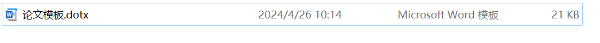
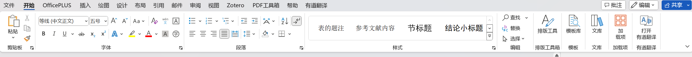
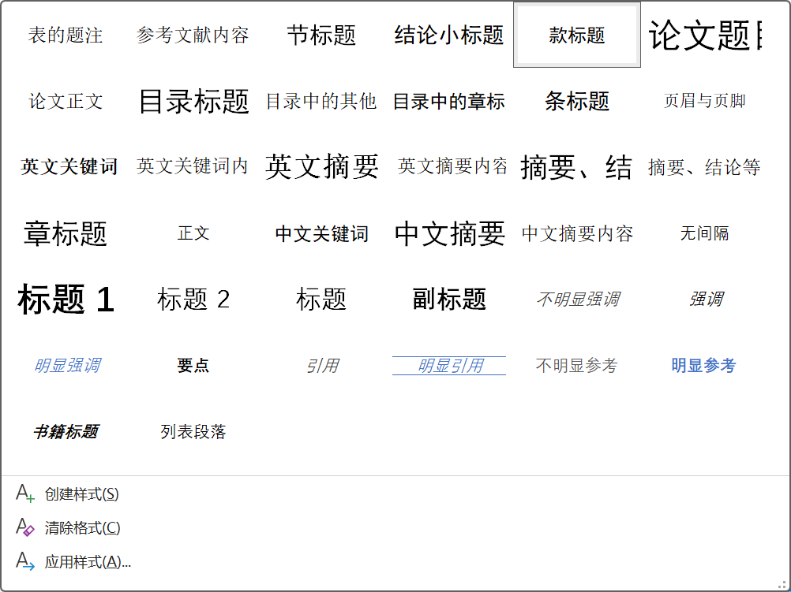
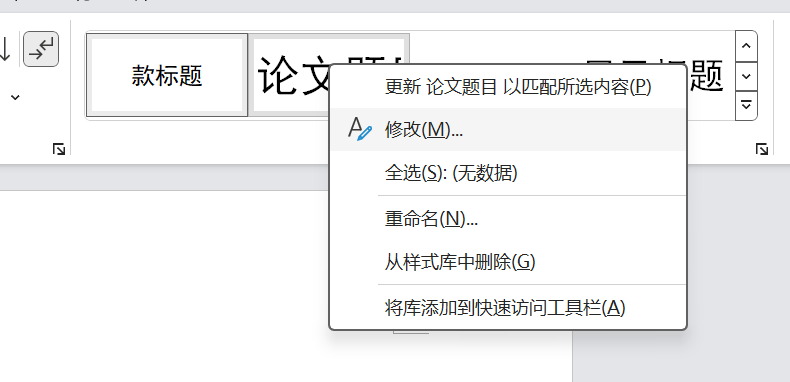
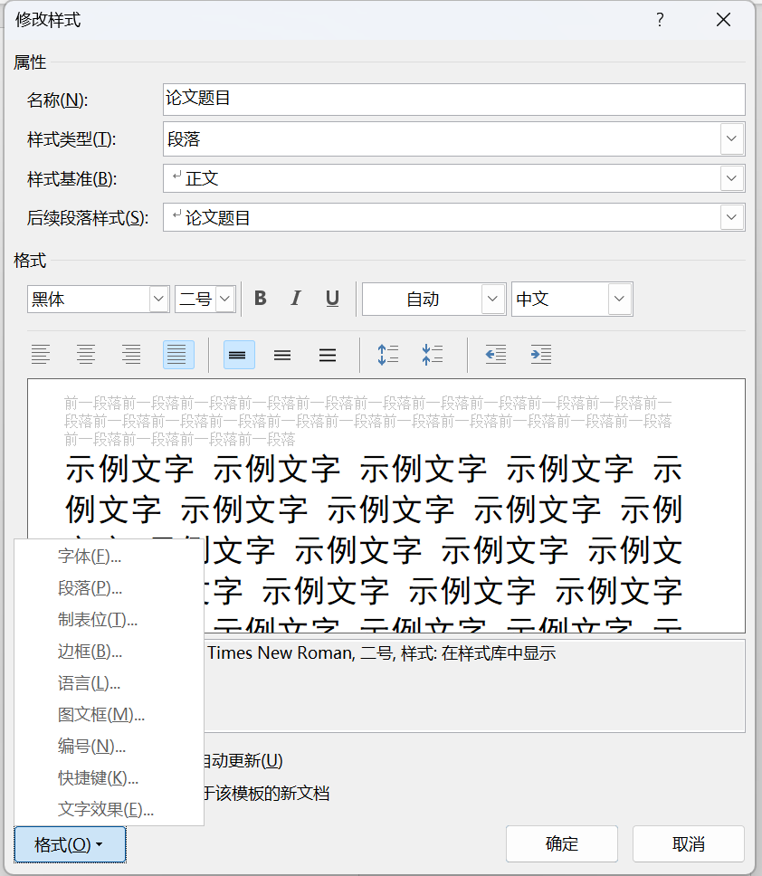

# 使用说明

将该模板文件下载到本地，随后双击运行

随后在样式一栏中可以根据自己的需要设置样式

请注意本模板中部分样式可能由于版本原因存在格式不正确，建议右键该样式进行修改，即可修改文字和段落

本模板根据2020级下发的毕业论文书写规范要求（见本文件夹附件）中的内容进行编辑，如有部分格式出错，欢迎纠正。

### 注意：

1. 由于目录应该使用域的方式自动生成，因此需要在目录设置中对目录单独设置

   方法：引用——目录——自定义目录
   

2. 由于word中题注仍存在bug（2021家庭版仍未解决），因此建议题注根据要求手动添加。

3. 该文件仅为样式集模板，建议封面内容参考自己导师下发的往届毕业生论文范文进行复制，或根据本文件夹内2020级下发的毕业论文书写规范要求进行自行设计。本文件夹内还包含去除敏感信息的封面可供参考。
